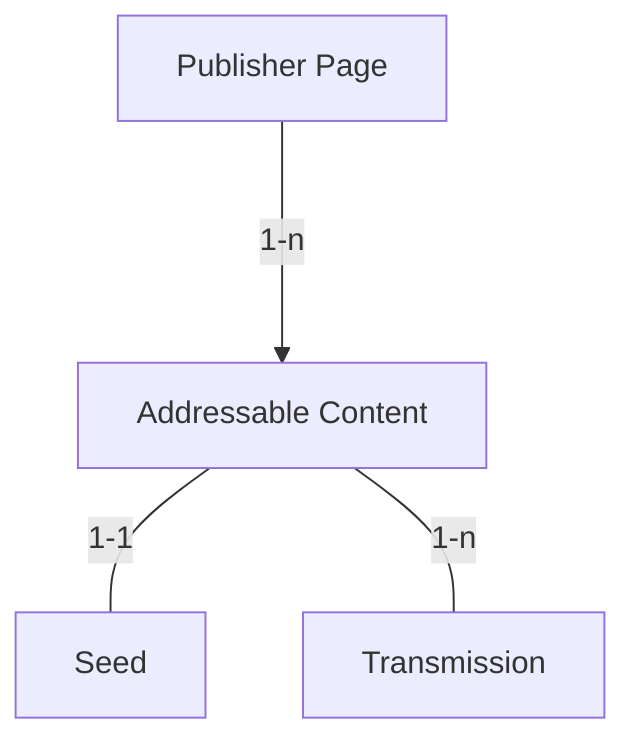
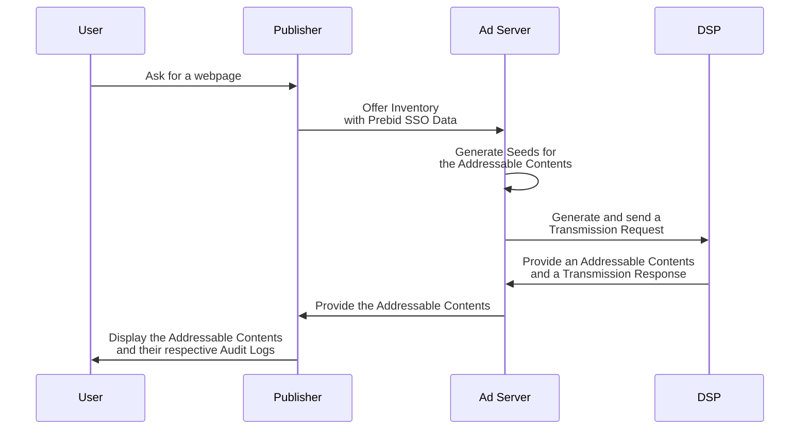
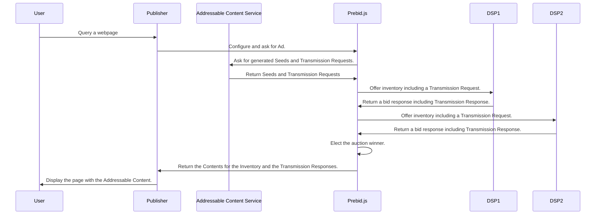

# Web site implementation

## Advertiser

Assumptions:

- it's ok to have backend implementation for advertisers

### User preferences

MVP: Redirect

- integration with operator: backend

- note: data can be used but not shared (otherwise, a transmission is needed)

JSON

- later

## Publisher

### User preferences

Redirect

- operator integration

JSON

### Inventory offer

#### Overview

A Publisher delegates the signatures of the Seeds and the Root Transmission
request to an *Addressable Content Service* before offering it as an inventory. 
This can be an Ad Server or an extra service. As a reminder, a Seed is the 
signed association of an Addressable Content with Prebid SSO Data.

In term of relationship, each placement has a Seed and at least 
one Transmission request.



#### Offer inventory with an Ad Server

In case of the setup with an Ad Server, the Publisher must adapt the webservice 
call for offering its inventory by adding the Prebid SSO cookies.

Here is an overview of the interactions between the Publisher Website, 
the Ad Server and the Ad Network:

<!--partial-begin { "files": [ "ad-server-flow.mmd" ], "block": "mermaid" } -->
<!-- ⚠️ GENERATED CONTENT - DO NOT MODIFY DIRECTLY ⚠️ -->

<!--partial-end-->

For this purpose, the Publisher need to implement the new API of the Ad Server
described in [mvp-spec/ad-server-implementation.md](./ad-server-implementation.md)

#### Offering inventory with Prebid.js (out of scope of the MVP for now)



##### Addressable Content Service Endpoint

The Publisher must call the Addressage Content Server Endpoint with the
Prebid SSO Data stored in the cookies of the User. It must consider the
cookie as an URL encoded raw data and send it as it is.

It must reach the following endpoint:
```
/v1/transmission
``` 
The following parameters must be sent in JSON in the payload of a POST request:

| Field    | Type                      | Details                               |
|----------|---------------------------|---------------------------------------|
| count    | Integer                   | Number of Addressable Contents                               |
| cookies  | Array of Cookies values   | All the cookies related to the Prebid Addressable Framework |

Example: 

```json
{
    "count": 2,
    "cookies": [
        <cookie 1>,
        <cookie 2>,
    ]
}
```

The response will be composed of the following:

| Field    | Type                      | Details                               |
|----------|---------------------------|---------------------------------------|
| seeds    | Array of Seed objects     | Digital signatures of the Transaction Id |
| body     | Body object               | Gather all the Prebid SSO Data         |


The Seed object:

| Field                  | Type                                     | Details  |
|------------------------|------------------------------------------|----------|
| version                | Number                                   | The Prebid SSO version of the object.|
| transaction_id         | String                                   | A GUID in a String format dedicated to the share of the Prebid SSO data for one Addressable Content.|
| source                 | Source object                            | The source contains data for identifying and trusting the Publisher.<br /><table><tr><th>Field</th><th>Type</th><th>Details</th></tr><tr><td>domain</td><td>String</td><td>The domain of the Root Party (Publisher in most of the cases).</td></tr><tr><td>timestamp</td><td>Integer</td><td>The timestamp of the signature.</td></tr><tr><td>signature</td><td>String</td><td>Encoded signature in UTF-8 of the Root Party/Publisher.</td></tr></table>|

The Body object:
| Field                  | Type                                     | Details  |
|------------------------|------------------------------------------|----------|
| preferences            | Preferences object                       | The Preferences of the user.|
| identifiers            | Array of Pseudonymous-Identifier objects | The Pseudonymous-Identifiers of the user. For now, it only contains a Prebid ID.|


<!--partial-begin { "files": [ "preferences-table.md" ] } -->
<!-- ⚠️ GENERATED CONTENT - DO NOT MODIFY DIRECTLY ⚠️ -->
| Field   | Type                   | Details                                   |
|---------|------------------------|-------------------------------------------|
| version | Number                 | The Prebid SSO version used.     |
| data    | Dictionary             | The keys are strings and represent the name of the preferences. <br /> The values represent the value of the preference. <br /> For now there is only one preference named "optin" and its value is a boolean.|
| source  | Source object          | The source contains the data for identifying and trusting the CMP that signed lastly the Preferences.<br /> <table><tr><th>Field</th><th>Type</th><th>Details</th></tr><tr><td>domain</td><td>String</td><td>The domain of the CMP.</td></tr><tr><td>timestamp</td><td>Integer</td><td>The timestamp of the signature.</td></tr><tr><td>signature</td><td>String</td><td>Encoded signature in UTF-8 of the CMP.</td></tr></table>|
<!--partial-end-->

<!--partial-begin { "files": [ "identifier-table.md" ] } -->
<!-- ⚠️ GENERATED CONTENT - DO NOT MODIFY DIRECTLY ⚠️ -->
| Field   | Type          | Details                                            |
|---------|---------------|----------------------------------------------------|
| version | Number        | The version of Prebid SSO used.                                                                       |
| type    | String        | The type of Pseudonymous-Identifier. For now, there is only one: "prebid_id".                                                    |
| value   | String        | The Pseudonymous-Identifier value in UTF-8.                                                                                      |
| source  | Source object | The Source contains all the data for identifying and trusting the Operator that generated the Pseudonymous-Identifier. <br /> <table><tr><th>Field</th><th>Type</th><th>Details</th></tr><tr><td>domain</td><td>String</td><td>The domain of the Operator.</td></tr><tr><td>timestamp</td><td>Integer</td><td>The timestamp of the signature.</td></tr><tr><td>signature</td><td>String</td><td>Encoded signature in UTF-8 of the Operator.</td></tr></table>|
<!--partial-end-->

Example:
<!--partial-begin { "files": [ "seed-optimized.json", "body-id-and-preferences.json" ], "jq": "{ seeds: [ .[0] , .[0]  ] } +  .[1]  | .seeds[1].transaction_id += 1" } -->
<!-- ⚠️ GENERATED CONTENT - DO NOT MODIFY DIRECTLY ⚠️ -->
```json
{
  "seeds": [
    {
      "version": 0,
      "transaction_id": 1234567,
      "publisher": "publisher.com",
      "source": {
        "domain": "adserver-company.com",
        "timestamp": 1639582000,
        "signature": "12345_signature"
      }
    },
    {
      "version": 0,
      "transaction_id": 1234568,
      "publisher": "publisher.com",
      "source": {
        "domain": "adserver-company.com",
        "timestamp": 1639582000,
        "signature": "12345_signature"
      }
    }
  ],
  "body": {
    "preferences": {
      "version": 1,
      "data": {
        "opt_in": true
      },
      "source": {
        "domain": "cmpC.com",
        "timestamp": 1639643112,
        "signature": "preferences_signature_xyz12345"
      }
    },
    "identifiers": [
      {
        "version": 1,
        "type": "prebid_id",
        "value": "7435313e-caee-4889-8ad7-0acd0114ae3c",
        "source": {
          "domain": "operator0.com",
          "timestamp": 1639643110,
          "signature": "prebid_id_signature_xyz12345"
        }
      }
    ]
  }
}
```
<!--partial-end-->

##### Publisher configuration

You can configure `prebid.js` so that it calls back you when it requires
Transmission signatures and Transaction signatures sign your Addressable 
Content Server and your Prebid SSO cookies. For this purpose, you need to 
update [the bootstrap](https://docs.prebid.org/dev-docs/getting-started.html) 
of `pbjs` with the properties `getSsoSignatures` with the call 
of your Addressable Content Service.

```js
pbjs.getSsoSignatures = function(onLoad) {
    const http = new XMLHttpRequest();
    http.onreadystatechange  = function() {
        if (this.readyState == 4 && this.status == 200) {
            var ssoSignatures = JSON.parse(this.responseText);
            onLoad(ssoSignatures);
        }
    }
    http.open("POST", "<Addressable Contente Server endpoint>", false);
    // configuration of your request.
    http.send();
}
```

##### Adaptator code

To use Prebid SSO, Prebid.js will extend its [Build Request API](https://docs.prebid.org/dev-docs/bidder-adaptor.html#building-the-request) 
so that the Adaptors get the Prebid SSO Data.

Each adunit has an extra `ssoSignature` string which represents the digital 
signature of the Prebid SSO data for the given adunit:

```js
[{
  adUnitCode: "test-div"
  auctionId: "b06c5141-fe8f-4cdf-9d7d-54415490a917"
  ...
  transactionId: "54a58774-7a41-494e-9aaf-fa7b79164f0c"
  ssoSignature: "304502204a7ee942fdaed0dcb43c...f35271510d"
}]
```

The `bidderRequest` has an extra `sso` object which contains the Prebid 
SSO Data of the user:

```js
{
    auctionId: "b06c5141-fe8f-4cdf-9d7d-54415490a917",
    gdprConsent: {
        consentString: "BOtmiBKOtmiBKABABAENAFAAAAACeAAA",
        vendorData: {...},
        gdprApplies: true
    },
    ...
    sso: {
        preferences: {
            version: 1,
            data: {
                opt_in: true
            },
            source: {
                domain: "cmpC.com",
                timestamp: 1639643112,
                signature: "preferences_signature_xyz12345"
            }
        },
        identifiers: [
            {
                version: 1,
                type: "prebid_id",
                value: "7435313e-caee-4889-8ad7-0acd0114ae3c",
                source: {
                    domain: "operator0.com",
                    timestamp: 1639643110,
                    signature: "prebid_id_signature_xyz12345"
                }
            }
        ]
    }
}
```


ℹ️  `TransactionId` already exists in the AdUnit.

So the buildRequest function can use the Prebid SSO Data to generate
its requests.

```js
buildRequests: function(validBidRequests, bidderRequest) {
    const tags = validBidRequests.map(adUnit => {
        const tag = {};
        // Build your internal object for the AdUnit
        // ...
        tag.transactionId = adUnit.transactionId;
        if (adUnit.ssoSignature) {
            tag.ssoSignature = adUnit.ssoSignature;
        }
    });

    // Retrive the Prebid SSO Data
    let prebidId = null;
    let prebidPreferences = null;
    if (bidderRequest.sso) {
        prebidId = bidderRequest.sso.find(id => { id.type == "prebid_id" });
        prebidPreferences = bidderRequest.sso.preferences;
    }

    //...
    const request = formatRequest(tags, prebidId, prebidPreferences);
    return request;
}
```

Then Prebid.js will extend the [Interpreting Request API](https://docs.prebid.org/dev-docs/bidder-adaptor.html#interpreting-the-response) so that the Adaptors
can return the Transmission Result.

The `bidResponse` has an extra parameter named `sso`. It contains a list of 
Transmission Results. This list must contain all the Transmission Results 
that have occurred for the given bid.

```js
{
    requestId: BID_ID,
    cpm: CPM,
    //...
    sso: {
        transmissions: [
            {
                version: 0,
                receiver: "ssp1.com",
                status: "SUCCESS",
                details: "",
                source: {
                    domain: "ssp1.com",
                    timestamp: 1639583000,
                    signature: "12345_signature"
                },
            },
             {
                version: 0,
                receiver: "dsp1.com",
                status: "SUCCESS",
                details: "",
                source: {
                    domain: "dsp1.com",
                    timestamp: 1639583000,
                    signature: "12345_signature"
                },
            },
        ]
    }
};
```

##

## CMP

## 

