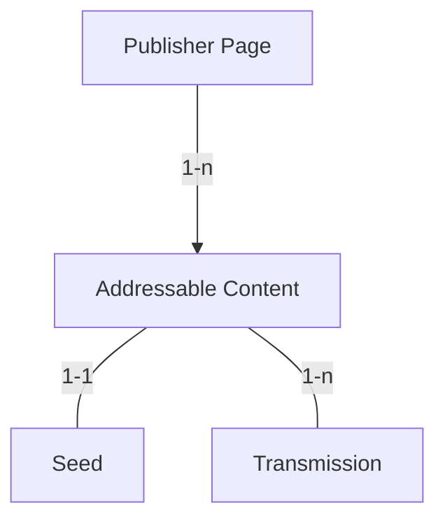
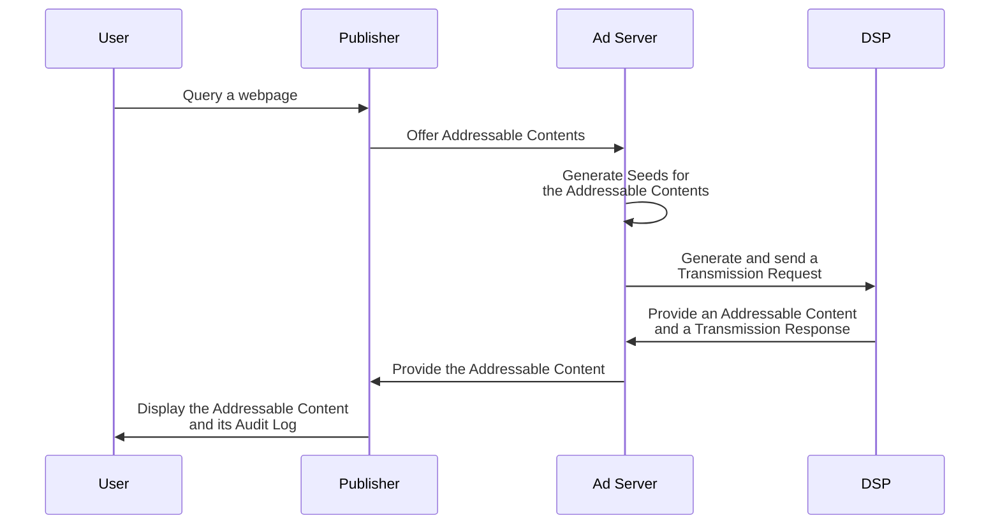
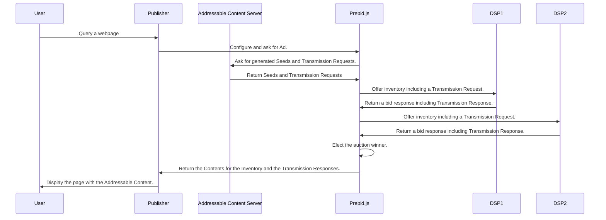

# Web site implementation

## Advertiser

Assumptions:

- it's ok to have backend implementation for advertisers

### User preferences

MVP: Redirect

- integration with operator: backend

- note: data can be used but not shared (otherwise, a transmission is needed)

JSON

- later

## Publisher

### User preferences

Redirect

- operator integration

JSON

### Inventory offer

#### Overview

A Publisher delegates the signatures of the Seeds and the Root Transmission
request to an *Addressable Content Server* before offering it as an inventory. 
This can be an Ad Server or an extra service. As a reminder, a Seed is the 
signed aggregation of Addressable Contents with the Prebid SSO Data.

Note that each placement has a Seed and at least one Transmission request.



#### Offering inventory with an Ad Server solution

We consider that the Ad Server is also the Addressable Content Server. This is 
the recommanded solution as it reduces the number of webservice calls for
a given Addressable Content.



##### Share Prebid SSO Data with the inventory

Prebid SSO doesn't standartized the API of the Ad Server for offering
Addressable Contents because each Ad Server has an existing and specific API. 
However, to implement Prebid SSO, the Ad Server need to follow guidances.

**1. Require the Prebid SSO Cookies**

The Ad Server API requires the Prebid SSO cookies that contain the 
encrypted Prebid SSO Data in its existing API. 

**2. Decrypt the Prebid SSO Data**

Via a shared cryptographic key, the Ad Server decrypts the Prebid SSO Cookies
so that it can read the Prebid SSO Data. Those Prebid SSO Data are composed of
one or many Pseudonymous-Identifiers and the Preferences of the user.

Here is the structure of a Pseudonymous-Identifier:

<!--partial-begin { "files": [ "identifier-table.md" ] } -->
| Field   | Type          | Details                                            |
|---------|---------------|----------------------------------------------------|
| version | Number        | The version of Prebid SSO used for signing the Identifier.                                                                       |
| type    | String        | The type of Pseudonymous-Identifier. For now, there is only one: "prebid_id".                                                    |
| value   | String        | The Pseudonymous-Identifier value in UTF-8.                                                                                      |
| source  | Source object | The Source contains all the data for identifying and trusting the Operator that generated the Pseudonymous-Identifier. <br /> <table><tr><th>Field</th><th>Type</th><th>Details</th></tr><tr><td>domain</td><td>String</td><td>The domain of the Operator.</td></tr><tr><td>timestamp</td><td>Integer</td><td>The timestamp of the signature.</td></tr><tr><td>signature</td><td>String</td><td>Encoded signature in UTF-8 of the Operator.</td></tr></table>|
<!--partial-end-->

Here is the structure of the Preferences:

<!--partial-begin { "files": [ "preferences-table.md" ] } -->
| Field   | Type                   | Details                                   |
|---------|------------------------|-------------------------------------------|
| version | Number                 | The Prebid SSO version of the object.     |
| data    | Dictionary             | The key is a string and represents the name of the preference. <br /> The values represent the value of the preference. <br /> For now there is only one preference named "optin" and its value is a boolean.|
| source  | Source object          | The source contains the data for identifying and trusting the CMP that signed lastly the Preferences.<br /> <table><tr><th>Field</th><th>Type</th><th>Details</th></tr><tr><td>domain</td><td>String</td><td>The domain of the CMP.</td></tr><tr><td>timestamp</td><td>Integer</td><td>The timestamp of the signature.</td></tr><tr><td>signature</td><td>String</td><td>Encoded signature in UTF-8 of the CMP.</td></tr></table>|
<!--partial-end-->

The Preferences object list all the preferences of a user in a dictionary. For
now, there is only one preference ("opt-in").

**3. Generate the Seed**

The Seed is the association of the Pseudonymous-Identifiers and the
Preferences of the user for a given Addressable Content. Once generated, a
Prebid SSO party in possession of a Seed can share it to another party via 
Transmissions (the next step). A Seed is signed by the Ad Server for 
auditability purpose. 

Here is the composition of a Seed:

<!--partial-begin { "files": [ "seed-optimized-table.md" ] } -->
| Field                  | Type                                     | Details  |
|------------------------|------------------------------------------|----------|
| version                | Number                                   | The Prebid SSO version of the object.|
| transaction_id         | String                                   | A GUID in a String format dedicated to the share of the Prebid SSO data for one Addressable Content.|
| publisher         | String                                   | The domain name of the Publisher that displays the Addressable Content|
| source                 | Source object                            | The source contains data for identifying and trusting the Publisher.<br /><table><tr><th>Field</th><th>Type</th><th>Details</th></tr><tr><td>domain</td><td>String</td><td>The domain of the Root Party (Publisher in most of the cases).</td></tr><tr><td>timestamp</td><td>Integer</td><td>The timestamp of the signature.</td></tr><tr><td>signature</td><td>String</td><td>Encoded signature in UTF-8 of the Root Party/Publisher.</td></tr></table>|
<!--partial-end-->

Here is a JSON example of the Seed:

<!--partial-begin { "files": [ "seed-optimized.json" ], "block": "json" } -->
```json
{
    "version": 0,
    "transaction_id": 1234567,
    "publisher": "publisher.com",
    "source": {
        "domain": "adserver-compagny.com",
        "timestamp": 1639582000,
        "signature": "12345_signature"
    }
}

```
<!--partial-end-->

The AdServer must sign the Seeds. The Elliptic Curve Digital Signature Algorithm
(ECDSA) is used for this purpose. NIST P-256 coupled with the hash algorithm
SHA-256 is applied on a build string that relies on the Seed data
and the Prebid SSO Data.

Here is how to build the UTF-8 string for generating the signature:

<!--partial-begin { "files": [ "seed-signature-string.txt" ], "block": "" } -->
```
seed.source.domain + '\u2063' + 
seed.source.timestamp + '\u2063' + 

seed.transaction_id + '\u2063' + 

seed.identifiers[0].source.signature + '\u2063' +
seed.identifiers[1].source.signature + '\u2063' +
... + '\u2063' + 
seed.identifiers[n].source.signature + '\u2063' + 

seed.preferences.source.signature

```
<!--partial-end-->

**4. Send Transmission Requests**

Once the Seeds are generated (one per Addressable Content), the Ad Server can
share the Prebid SSO Data via Transmissions with inventory data to 
Prebid SSO Parties. In the case of an existing custom communication 
(a.k.a not OpenRTB), the Transmission Requests must be included in the existing
communication and binded struturaly or by reference to the data of the 
impressions (also named Addressable Content).

A Transmission Request is composed as followed:

<!--partial-begin { "files": [ "transmission-request-table.md" ] } -->

| Field  | Type                            | Details                           |
|--------|---------------------------------|-----------------------------------|
| version| Number                          | The Prebid SSO version of the object.               |
| seed   | Seed object                     | A Seed object contains all the Prebid SSO Data gathered and signed by the Publisher concerning the user. |
| parents| Array of Transmission Results   | A list of Transmission Results that participate to a chain of Transmissions and make this Transmission possible. |  
| source | Source object                   | The source object contains data for identifying the Sender of the Transmission.<br /><table><tr><th>Field</th><th>Type</th><th>Details</th></tr><tr><td>domain</td><td>String</td><td>The domain of the Sender.</td></tr><tr><td>timestamp</td><td>Integer</td><td>The timestamp of the signature.</td></tr><tr><td>signature</td><td>String</td><td>Encoded signature in UTF-8 of the Tranmission sender.</td></tr></table>|
<!--partial-end-->

Similarly to the Seed, the Transmission Request contains a signature for 
auditability purpose. It used the data of the Transaction Request and the domain
name of the Receiver with the same cryptographic algorithm.

Here is how to build the UTF-8 string:

<!--partial-begin { "files": [ "transmission-request-signature-string.txt" ], "block": "" } -->
```
transmission_request_receiver_domain        + '\u2063' +
transmission_request.source.domain          + '\u2063' + 
transmission_request.source.timestamp       + '\u2063' + 
seed.source.signature

```
<!--partial-end-->

In the communication, the Transmission Requests must be associated to the 
Prebid SSO Data. Depending of the existing structure of the communication,
it makes sense to have a shared structure for the Prebid SSO Data and 
multiple Transmissions refering to it.

Here is a non-standardized example that must be adapted to the existing API:

<!--partial-begin { "files": [ "transmission-requests.json" ], "block": "json" } -->
```json
{
    "data": {
        "identifiers": [
            {
                "version": 0,
                "type": "prebid_id",
                "value": "7435313e-caee-4889-8ad7-0acd0114ae3c",
                "source": {
                    "domain": "operator0.com",
                    "timestamp": 1639580000,
                    "signature": "12345_signature"
                }
            }
        ],
        "preferences": {
            "data": { 
                "opt_in": true 
            },
            "source": {
                "domain": "cmp1.com",
                "timestamp": 1639581000,
                "signature": "12345_signature"
            }
        }
    },
    "transmissions": [
        {
            "version": 0,
            "seed": {
                "version": 0,
                "transaction_id": 1234567,
                "source": {
                    "domain": "publisher.com",
                    "timestamp": 1639582000,
                    "signature": "12345_signature"
                }
            },
            "source": {
                "domain": "cmp1.com",
                "timestamp": 1639581000,
                "signature": "12345_signature"
            },
            "parents": []
        },
        {
            "version": 0,
            "seed": {
                "version": 0,
                "transaction_id": 1234567,
                "source": {
                    "domain": "publisher.com",
                    "timestamp": 1639582000,
                    "signature": "12345_signature"
                }
            },
            "source": {
                "domain": "cmp1.com",
                "timestamp": 1639581000,
                "signature": "12345_signature"
            },
            "parents": []
        }
    ]
}
```
<!--partial-end-->

**5. Receive Transmission Responses**

The Receiver of the Transmission Requests answers back with Transmission 
Responses. Thoses Transmission Responses are included in the usual response of
an inventory offer. Each Transmission Response doesn't necessary have a 
Transmission Response only those that have been useful for generating the 
Addressable Content.

A Transmission Response is composed as followed:

<!--partial-begin { "files": [ "transmission-response-table.md" ] } -->
| Field           | Type                          | Details                           |
|-----------------|-------------------------------|-----------------------------------|
| version         | Number                        | The version of the Prebid SSO used for generating the Transmission Response.                                                                                                                                                                                                                               |
| transaction_id  | String                        | A GUID dedicated to the Addressable Content. It allows to associate the Transmission Responses to Transmission Request                                                                                                                     |
| receiver        | String                        | The domain name of the DSP.                                                                                                                                                                                                                                                                                |
| status          | String                        | Equals "success" if the DSP signed the Transmission and returns it to the sender.<br /> Equals "error_bad_request" if the receiver doesn't understand or see inconsistency in the Transmission Request.<br /> Equals "error_cannot_process" if the receiver cannot handle the Transmission Request properly. |
| details         | String                        | In case of an error status, the DSP can provide details concerning the error.                                                                                                                                                                                                                              |
| children        | Array of Transmission Results | An empty array as we consider that the DSP doesn't share the Prebid SSO Data to its suppliers via new transmissions.                                                                                                                                                                                       |
| source          | Source object                 | The source contains all the data for identifying the DSP and verifying the Transmission.                                                                                                                                                                                                                   |
<!--partial-end-->

Therefore, here is a non-standardized example of Transmission Responses that
must be adapted to the existing API:

<!--partial-begin { "files": [ "transmission-requests.json" ], "block": "json" } -->
```json
{
    "data": {
        "identifiers": [
            {
                "version": 0,
                "type": "prebid_id",
                "value": "7435313e-caee-4889-8ad7-0acd0114ae3c",
                "source": {
                    "domain": "operator0.com",
                    "timestamp": 1639580000,
                    "signature": "12345_signature"
                }
            }
        ],
        "preferences": {
            "data": { 
                "opt_in": true 
            },
            "source": {
                "domain": "cmp1.com",
                "timestamp": 1639581000,
                "signature": "12345_signature"
            }
        }
    },
    "transmissions": [
        {
            "version": 0,
            "seed": {
                "version": 0,
                "transaction_id": 1234567,
                "source": {
                    "domain": "publisher.com",
                    "timestamp": 1639582000,
                    "signature": "12345_signature"
                }
            },
            "source": {
                "domain": "cmp1.com",
                "timestamp": 1639581000,
                "signature": "12345_signature"
            },
            "parents": []
        },
        {
            "version": 0,
            "seed": {
                "version": 0,
                "transaction_id": 1234567,
                "source": {
                    "domain": "publisher.com",
                    "timestamp": 1639582000,
                    "signature": "12345_signature"
                }
            },
            "source": {
                "domain": "cmp1.com",
                "timestamp": 1639581000,
                "signature": "12345_signature"
            },
            "parents": []
        }
    ]
}
```
<!--partial-end-->

**6. Generate the Audit Log**

Once the Ad Server has selected the supplier that will display the
Addressable Content, it must generate the Audit Log based on the related
Transmission Response and the Prebid SSO Data.

The Audit Log has the following structure:

<!--partial-begin { "files": [ "audit-log-table.md" ] } -->
| Field         | Type                         | Detail                        |
|---------------|------------------------------|-------------------------------|
| seed          | Seed Object                  | The Seed object already described in this document. |
| transmissions | List of Transmission Results | A list of Transmission Results |
<!--partial-end-->

As described, the Audit Log contains a list of Transmission Results. The 
Transmission Results are build thanks to the data within the received 
Transmission Response that participate to the Addressable Content. The required
data are the status and the signature of the Transmission Response and its 
children.

Here is the structure of a Transmission Result:

<!--partial-begin { "files": [ "transmission-result-table.md" ] } -->
| Field           | Type                          | Details                           |
|-----------------|-------------------------------|-----------------------------------|
| version         | Number                        | The version of the Prebid SSO used for generating the Transmission Response.                                                                                                                                                                                                                               |
| receiver        | String                        | The domain name of the DSP.                                                                                                                                                                                                                                                                                |
| status          | String                        | Equals "success" if the DSP signed the Transmission and returns it to the sender.<br /> Equals "error_bad_request" if the receiver doesn't understand or see inconsistency in the Transmission Request.<br /> Equals "error_cannot_process" if the receiver cannot handle the Transmission Request properly. |
| details         | String                        | In case of an error status, the DSP can provide details concerning the error.                                                                                                                                                                                                                              |
| source          | Source object                 | The source contains all the data for identifying the DSP and verifying the Transmission.                                                                                                                                                                                                                   |
<!--partial-end-->

Let's take an example of a transformation to Transmission Results.
Here is a received Transmission Response that help to generate the Addressable Content:

<!--partial-begin { "files": [ "transmission-response-with-children.json" ], "block": "json" } -->
```json
{
    "version": 0,
    "transaction_id": 1234567,
    "receiver": "ssp1.com",
    "status": "success",
    "details": "",
    "source": {
        "domain": "ssp1.com",
        "timestamp": 1639589531,
        "signature": "12345_signature"
    },
    "children": [
        {
            "receiver": "ssp2.com",
            "status": "success",
            "details": "",
            "source": {
                "domain": "ssp2.com",
                "timestamp": 1639589531,
                "signature": "12345_signature"
            }
        },
        {
            "receiver": "dsp.com",
            "status": "success",
            "details": "",
            "source": {
                "domain": "dsp.com",
                "timestamp": 1639589531,
                "signature": "12345_signature"
            }
        }
    ]
}
```
<!--partial-end-->

Here are the associated list of Transmission Result:

<!--partial-begin { "files": [ "transmission-responses.json" ], "block": "json" } -->
```json
{
    "transmissions": [
        {
            "version": 0,
            "transaction_id": 1234567,
            "receiver": "dsp1.com",
            "status": "success",
            "details": "",
            "source": {
                "domain": "dsp1.com",
                "timestamp": 1639589531,
                "signature": "12345_signature"
            },
            "children": []
        },
        {
            "version": 0,
            "transaction_id": 12345678,
            "receiver": "dsp1.com",
            "status": "success",
            "details": "",
            "source": {
                "domain": "dsp1.com",
                "timestamp": 1639589531,
                "signature": "12345_signature"
            },
            "children": []
        }
    ]
}

```
<!--partial-end-->

After this transformation, it is possible to generate the Audit Log. Here is
an example:

<!--partial-begin { "files": [ "audit-log.json" ], "block": "json" } -->
```json
{
    "data": {
        "identifiers": [
            {
                "version": 0,
                "type": "prebid_id",
                "value": "7435313e-caee-4889-8ad7-0acd0114ae3c",
                "source": {
                    "domain": "operotor0.com",
                    "timestamp": 1639589531,
                    "signature": "12345_signature"
                }
            }
        ],
        "preferences": {
            "version": 0,
            "data": { 
                "opt_in": true 
            },
            "source": {
                "domain": "cmp1.com",
                "timestamp": 1639589531,
                "signature": "12345_signature"
            }
        }
    },
    "seed": {
        "version": 0,
        "transaction_id": 1234567,
        "publisher": "publisher.com",
        "source": {
          "domain": "operator0.com",
          "timestamp": 1639589531,
          "signature": "12345_signature"
        }
    },
    "transmissions": [
        {
            "version": 0,
            "receiver": "ssp1.com",
            "status": "success",
            "details": "",
            "source": {
                "domain": "ssp1.com",
                "timestamp": 1639589531,
                "signature": "12345_signature"
            }
        },
        {
            "version": 0,
            "receiver": "ssp2.com",
            "status": "success",
            "details": "",
            "source": {
                "domain": "ssp2.com",
                "timestamp": 1639589531,
                "signature": "12345_signature"
            }
        },
        {
            "version": 0,
            "receiver": "dsp.com",
            "status": "success",
            "details": "",
            "source": {
                "domain": "dps.com",
                "timestamp": 1639589531,
                "signature": "12345_signature"
            }
        }
    ]
}
```
<!--partial-end-->

**7. Display the Addressable Content and make the Audit Log available**

Finally, the Addressable Content can be displayed and depending of the 
implementation choice, the Audit Log can be added in an hidden tag in the
DOM or log in the console.


#### Offering inventory with Prebid.js (out of scope of the MVP for now)



##### Addressable Content Server Endpoint

The Publisher must call the Addressage Content Server Endpoint with the
Prebid SSO Data stored into the cookies of the User. It must consider the
cookie as an URL encoded raw data and send it as it is.

It must reach the following endpoint:
```
/v1/transmission
``` 
The following parameters must be sent in JSON in the payload of a POST request:

| Field    | Type                      | Details                               |
|----------|---------------------------|---------------------------------------|
| count    | Integer                   | Number of Addressable Contents                               |
| cookies  | Array of Cookies values   | All the cookies related to the Prebid Addressable Framework |

Example: 

```json
{
    "count": 2,
    "cookies": [
        <cookie 1>,
        <cookie 2>,
    ]
}
```

The response will be composed of the following:

| Field    | Type                      | Details                               |
|----------|---------------------------|---------------------------------------|
| seeds    | Array of Seed objects     | Digital signatures of the Transaction Id |
| body     | Body object               | Gather all the Prebid SSO Data         |


The Seed object:

| Field                  | Type                                     | Details  |
|------------------------|------------------------------------------|----------|
| version                | Number                                   | The Prebid SSO version of the object.|
| transaction_id         | String                                   | A GUID in a String format dedicated to the share of the Prebid SSO data for one Addressable Content.|
| source                 | Source object                            | The source contains data for identifying and trusting the Publisher.<br /><table><tr><th>Field</th><th>Type</th><th>Details</th></tr><tr><td>domain</td><td>String</td><td>The domain of the Root Party (Publisher in most of the cases).</td></tr><tr><td>timestamp</td><td>Integer</td><td>The timestamp of the signature.</td></tr><tr><td>signature</td><td>String</td><td>Encoded signature in UTF-8 of the Root Party/Publisher.</td></tr></table>|

The Body object:
| Field                  | Type                                     | Details  |
|------------------------|------------------------------------------|----------|
| preferences            | Preferences object                       | The Preferences of the user.|
| identifiers            | Array of Pseudonymous-Identifier objects | The Pseudonymous-Identifiers of the user. For now, it only contains a Prebid ID.|


<!--partial-begin { "files": [ "preferences-table.md" ] } -->
| Field   | Type                   | Details                                   |
|---------|------------------------|-------------------------------------------|
| version | Number                 | The Prebid SSO version of the object.     |
| data    | Dictionary             | The key is a string and represents the name of the preference. <br /> The values represent the value of the preference. <br /> For now there is only one preference named "optin" and its value is a boolean.|
| source  | Source object          | The source contains the data for identifying and trusting the CMP that signed lastly the Preferences.<br /> <table><tr><th>Field</th><th>Type</th><th>Details</th></tr><tr><td>domain</td><td>String</td><td>The domain of the CMP.</td></tr><tr><td>timestamp</td><td>Integer</td><td>The timestamp of the signature.</td></tr><tr><td>signature</td><td>String</td><td>Encoded signature in UTF-8 of the CMP.</td></tr></table>|
<!--partial-end-->

<!--partial-begin { "files": [ "identifier-table.md" ] } -->
| Field   | Type          | Details                                            |
|---------|---------------|----------------------------------------------------|
| version | Number        | The version of Prebid SSO used for signing the Identifier.                                                                       |
| type    | String        | The type of Pseudonymous-Identifier. For now, there is only one: "prebid_id".                                                    |
| value   | String        | The Pseudonymous-Identifier value in UTF-8.                                                                                      |
| source  | Source object | The Source contains all the data for identifying and trusting the Operator that generated the Pseudonymous-Identifier. <br /> <table><tr><th>Field</th><th>Type</th><th>Details</th></tr><tr><td>domain</td><td>String</td><td>The domain of the Operator.</td></tr><tr><td>timestamp</td><td>Integer</td><td>The timestamp of the signature.</td></tr><tr><td>signature</td><td>String</td><td>Encoded signature in UTF-8 of the Operator.</td></tr></table>|
<!--partial-end-->

Example:
<!--partial-begin { "files": [ "seed-optimized.json", "body-id-and-preferences.json" ], "jq": "{ seeds: [ .[0] , .[0]  ] } +  .[1]  | .seeds[1].transaction_id += 1" } -->
```json
{
  "seeds": [
    {
      "version": 0,
      "transaction_id": 1234567,
      "publisher": "publisher.com",
      "source": {
        "domain": "adserver-compagny.com",
        "timestamp": 1639582000,
        "signature": "12345_signature"
      }
    },
    {
      "version": 0,
      "transaction_id": 1234568,
      "publisher": "publisher.com",
      "source": {
        "domain": "adserver-compagny.com",
        "timestamp": 1639582000,
        "signature": "12345_signature"
      }
    }
  ],
  "body": {
    "preferences": {
      "version": 1,
      "data": {
        "opt_in": true
      },
      "source": {
        "domain": "cmpC.com",
        "timestamp": 1639643112,
        "signature": "preferences_signature_xyz12345"
      }
    },
    "identifiers": [
      {
        "version": 1,
        "type": "prebid_id",
        "value": "7435313e-caee-4889-8ad7-0acd0114ae3c",
        "source": {
          "domain": "operator0.com",
          "timestamp": 1639643110,
          "signature": "prebid_id_signature_xyz12345"
        }
      }
    ]
  }
}
```
<!--partial-end-->

##### Publisher configuration

You can configure `prebid.js` so that it calls back you when it requires
Transmission signatures and Transaction signatures sign your Addressable 
Content Server and your Prebid SSO cookies. For this purpose, you need to 
update [the bootstrap](https://docs.prebid.org/dev-docs/getting-started.html) 
of `pbjs` with the properties `getSsoSignatures` with the call 
of your Addressable Content Server.

```js
pbjs.getSsoSignatures = function(onLoad) {
    const http = new XMLHttpRequest();
    http.onreadystatechange  = function() {
        if (this.readyState == 4 && this.status == 200) {
            var ssoSignatures = JSON.parse(this.responseText);
            onLoad(ssoSignatures);
        }
    }
    http.open("POST", "<Addressable Contente Server endpoint>", false);
    // configuration of your request.
    http.send();
}
```

##### Adaptator code

To use Prebid SSO, Prebid.js will extend its [Build Request API](https://docs.prebid.org/dev-docs/bidder-adaptor.html#building-the-request) 
so that the Adaptors get the Prebid SSO Data.

Each adunit has an extra `ssoSignature` string which represent the digital 
signature of the Prebid SSO data for the given adunit:

```js
[{
  adUnitCode: "test-div"
  auctionId: "b06c5141-fe8f-4cdf-9d7d-54415490a917"
  ...
  transactionId: "54a58774-7a41-494e-9aaf-fa7b79164f0c"
  ssoSignature: "304502204a7ee942fdaed0dcb43c...f35271510d"
}]
```

The `bidderRequest` has an extra `sso` object which contains the Prebid 
SSO Data of the user:

```js
{
    auctionId: "b06c5141-fe8f-4cdf-9d7d-54415490a917",
    gdprConsent: {
        consentString: "BOtmiBKOtmiBKABABAENAFAAAAACeAAA",
        vendorData: {...},
        gdprApplies: true
    },
    ...
    sso: {
        preferences: {
            version: 1,
            data: {
                opt_in: true
            },
            source: {
                domain: "cmpC.com",
                timestamp: 1639643112,
                signature: "preferences_signature_xyz12345"
            }
        },
        identifiers: [
            {
                version: 1,
                type: "prebid_id",
                value: "7435313e-caee-4889-8ad7-0acd0114ae3c",
                source: {
                    domain: "operator0.com",
                    timestamp: 1639643110,
                    signature: "prebid_id_signature_xyz12345"
                }
            }
        ]
    }
}
```


ℹ️  `TransactionId` already exist in the AdUnit.

So the buildRequest function can use the Prebid SSO Data to generate
its requests.

```js
buildRequests: function(validBidRequests, bidderRequest) {
    const tags = validBidRequests.map(adUnit => {
        const tag = {};
        // Build your internal object for the AdUnit
        // ...
        tag.transactionId = adUnit.transactionId;
        if (adUnit.ssoSignature) {
            tag.ssoSignature = adUnit.ssoSignature;
        }
    });

    // Retrive the Prebid SSO Data
    let prebidId = null;
    let prebidPreferences = null;
    if (bidderRequest.sso) {
        prebidId = bidderRequest.sso.find(id => { id.type == "prebid_id" });
        prebidPreferences = bidderRequest.sso.preferences;
    }

    //...
    const request = formatRequest(tags, prebidId, prebidPreferences);
    return request;
}
```

Then Prebid.js will extend the [Interpreting Request API](https://docs.prebid.org/dev-docs/bidder-adaptor.html#interpreting-the-response) so that the Adaptors
can return the Transmission Result.

The `bidResponse` has an extra parameter named `sso`. It contains a list of 
Transmission Results. This list must contains all the Transmission Results 
that have occured for the given bid.

```js
{
    requestId: BID_ID,
    cpm: CPM,
    //...
    sso: {
        transmissions: [
            {
                version: 0,
                receiver: "ssp1.com",
                status: "SUCCESS",
                details: "",
                source: {
                    domain: "ssp1.com",
                    timestamp: 1639583000,
                    signature: "12345_signature"
                },
            },
             {
                version: 0,
                receiver: "dsp1.com",
                status: "SUCCESS",
                details: "",
                source: {
                    domain: "dsp1.com",
                    timestamp: 1639583000,
                    signature: "12345_signature"
                },
            },
        ]
    }
};
```

##

## CMP

## 


